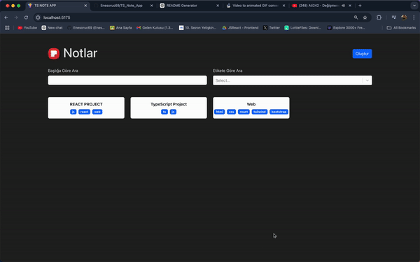

# Note Application

**Note Application** is a React and TypeScript-based app that allows users to manage their notes effectively. Users can create, edit, delete, and filter notes, ensuring a seamless and productive experience.

## Features

- **Add Notes**: Quickly add new notes with custom content.
- **Edit Notes**: Update existing notes with new information.
- **Delete Notes**: Remove unwanted notes easily.
- **Filter Notes**: Use filters to find specific notes based on criteria.
- **Markdown Support**: Notes support rich text formatting with **React Markdown**.
- **Responsive Design**: Styled with **React Bootstrap** and **Bootstrap** for a modern and adaptable interface.

## Technologies Used

- **React**: Core framework for building the user interface.
- **TypeScript**: Ensures type safety and maintainable code.
- **React Router DOM**: Manages navigation and routing between pages.
- **React Bootstrap**: Provides styled UI components.
- **Bootstrap**: Adds responsive design and layout styles.
- **React Markdown**: Enables rich text formatting within notes.
- **React Select**: Allows dynamic filtering with dropdowns.
- **UUID**: Generates unique IDs for notes.

